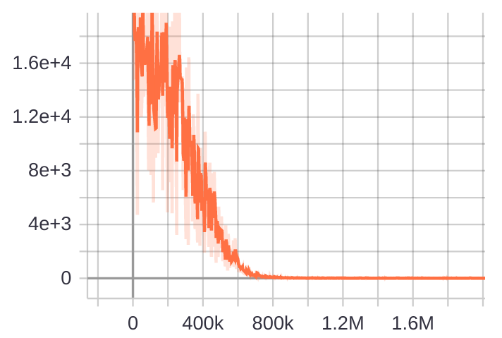
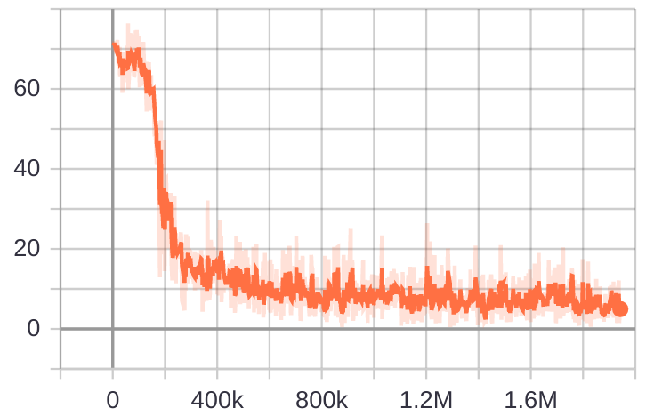

# Multigrid Neural Memory
The repository contains sample implementations for the [Multigrid Neural Memory](https://arxiv.org/abs/1906.05948) architectures.

## Dependency
- Tensorflow 1.15
- Python 2.7
- OpenCV-Python
- Python-MNIST

## Content
Subdirectories contain sample code for corresponding tasks:
- mapping_localization: mapping and localization task. The sample code for an agent moving in spiral motion with 3x3 observations and 3x3 queries is provided.
- mnist_recall: associative recall + classification task on mnist digits.

## Usage
- The code in each directory is self-contained. Training can be invoked by calling:
```
python main.py
```
- Learning curves should look like the following:
### Mapping & Localization Task:

### MNIST Associative Recall & Classification:


- Inference visualization is generated periodically during training, and saved in CHECKPOINT_DIR/[TIME-STEP]. The interval for saving visualization can be controlled by SAVE_VIS_INTERVAL in constants.py. 

## Acknowledgement
Part of the code structure was adapted from miyosuda's [implementation](https://github.com/miyosuda/async_deep_reinforce) of A3C.
