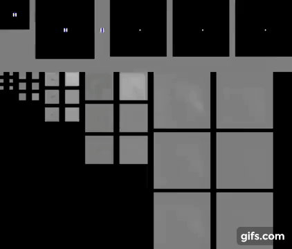
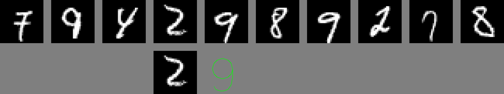

# Multigrid Neural Memory
The repository contains sample implementations for the [Multigrid Neural Memory](https://arxiv.org/abs/1906.05948) architectures.

To cite this work, please use:
```
@INPROCEEDINGS{HuynhICML2020,
  author = {Tri Huynh and Michael Maire and Matthew R. Walter},
  title = {Multigrid Neural Memory},
  booktitle = {International Conference on Machine Learning (ICML)},
  year = {2020}
}
```

## Dependency
- Tensorflow 1.15
- Python 2.7
- OpenCV-Python
- Python-MNIST

## Content
Subdirectories contain sample code for corresponding tasks:
- **mapping_localization**: mapping and localization task. The sample code for an agent moving in spiral motion with 3x3 observations and 3x3 queries is provided.
- **mnist_recall**: associative recall + classification task on mnist digits.

## Usage
- The code in each directory is self-contained. Training can be invoked by calling:
```
python main.py
```
- Learning curves should look like the following:

**Mapping & Localization Task:**<br/>


**MNIST Associative Recall & Classification:**<br/>


- Inference visualization is generated periodically during training, and saved in CHECKPOINT_DIR/[TIME-STEP]. The interval for saving visualization can be controlled by SAVE_VIS_INTERVAL in constants.py. Sample visualizations are provided below:

**Mapping & Localization Task:**<br/>
See the [project page](http://people.cs.uchicago.edu/~trihuynh/multigrid_mem/) for annotations and more demos.<br/>


**MNIST Associative Recall & Classification:**<br/>
Top row visualizes the input sequence. Bottom row shows the query image and the predicted output class of the following digit aligned to their corresponding positions in the top row.<br/>



## Acknowledgement
Part of the code structure was adapted from miyosuda's [implementation](https://github.com/miyosuda/async_deep_reinforce) of A3C.
